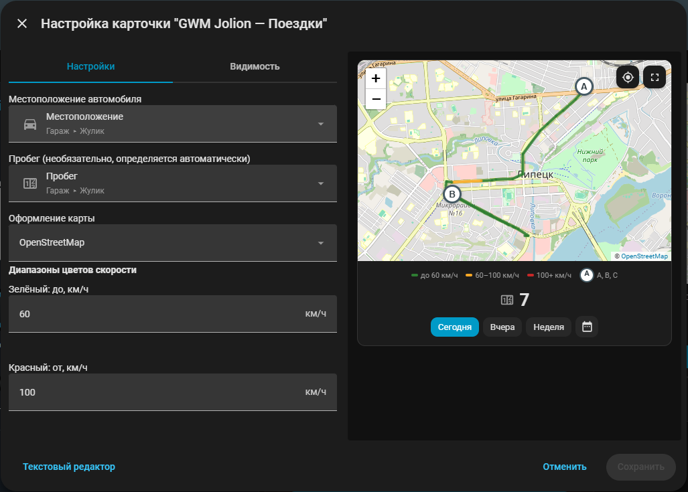
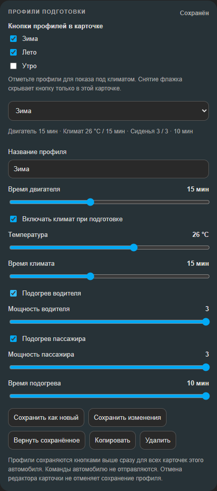

<p align="center"></p>

# GWM Jolion для Home Assistant

Неофициальная интеграция для **Haval Jolion с российским GWM Cloud**: состояние автомобиля, удалённое управление и три встроенные карточки. Разрабатывается на Haval Jolion 2022 Premium.

Версия **0.1.0-beta.24** · [Изменения](CHANGELOG.md) · [Планы](ROADMAP.md)

В **Настройки → Устройства и службы → GWM Jolion → Настроить** доступен отдельный ползунок **«Интервал обновления GPS»** (10–3600 секунд). Для наиболее частого сбора точек выберите 10 секунд; остальные данные можно опрашивать раз в 5 минут. Существующие настройки сохраняются, для новой установки GPS настроен на 10 секунд. При сетевых ошибках и ограничениях облака опрос временно замедляется, после успешного ответа возвращается к выбранному интервалу. Частый опрос не заставляет автомобиль чаще передавать координаты в облако.

## Возможности

- Двигатель, замок, двери, окна, багажник и состояние климата.
- Топливо, запас хода, пробег, давление и температура четырёх шин.
- Местоположение на карте, связь с автомобилем и время обновления.
- История маршрутов и пробег за день или выбранный период.
- Запуск и остановка двигателя, замок, багажник, световой и звуковой сигналы.
- Климат: включение, температура и время работы.
- Подогрев водительского и пассажирского сидений: уровни **0–3**, таймер **1–10 минут**.
- Закрытие окон и проветривание.
- Профили подготовки автомобиля: температура, таймеры и подогревы, сохранение и запуск одной кнопкой.

**Подогревы сидений и обновлённые команды окон требуют проверки на автомобиле.** Набор функций зависит от комплектации; облачные данные могут приходить с задержкой.

## Карточки

### Поездки — карта и пробег

<p align="center"></p>

В редакторе доступно **«Оформление карты»**: светлая Positron (по умолчанию), тёмная Dark, стандартная Liberty от OpenFreeMap и прежняя OpenStreetMap. API-ключ и регистрация не нужны. Маршрут и выбранный период сохраняются при смене оформления.

В правом верхнем углу карты находятся две кнопки: первая возвращает текущее местоположение автомобиля в центр карты, вторая разворачивает карту на весь экран. Повторное нажатие сворачивает её обратно. Масштаб карты меняется колесом мыши или щипком на сенсорном экране, положение — перетаскиванием мышью или одним пальцем.

Цвет участка показывает среднюю скорость между соседними GPS-точками. По умолчанию зелёный используется до 80 км/ч, жёлтый — от 80 до 110 км/ч, красный — от 110 км/ч. В графическом редакторе можно изменить пороги «Зелёный: до» и «Красный: от»; жёлтый диапазон рассчитывается между ними. Интервалы стоянки и короткого GPS-дрожания не считаются движением и не рисуются цветными линиями. При наведении на участок показывается его средняя скорость; это не мгновенная скорость, поэтому редкий опрос GPS, светофоры и остановки делают оценку приблизительной.

Стоянки продолжительностью не менее 10 минут и смещением не более 30 метров отмечаются точками маршрута `A`, `B`, `C` и далее. Нумерация идёт последовательно по всему выбранному периоду и начинается заново только при смене периода; одна стоянка через полночь отображается отдельными буквами в каждом затронутом дне. Начало и конец общего маршрута отдельными точками больше не показываются. При наведении на букву отображаются время начала и, если автомобиль уже уехал, время окончания. Для периода из нескольких дней, а также для стоянки между разными датами показываются полные даты. Пока движение после стоянки не записано, строка окончания не показывается. Резкие скачки между GPS-точками считаются потерей связи и не отмечаются как парковка.

Добавьте карточку **«GWM Jolion — Поездки»** и выберите сущность местоположения своего автомобиля в её графическом редакторе. Карта расположена сверху, под ней — пробег, кнопки «Сегодня», «Вчера», «Неделя» и пиктограмма календаря для выбора периода. День считается по часовому поясу Home Assistant, от полуночи до следующей полуночи.

```yaml
type: custom:gwm-jolion-trips-card
entity: device_tracker.имя_вашего_автомобиля
title: Поездки
speed_green_max: 80
speed_red_min: 110
```

Новые записи накапливаются с частотой опроса GPS. Карточка также читает сохранившуюся историю сущностей из Recorder Home Assistant: местоположение берётся из `device_tracker`, пробег — из датчика одометра того же автомобиля. Датчик определяется автоматически или выбирается в редакторе карточки. Архив дополняет маршрут за весь выбранный период, включая пропуски локального сбора, без двойного подсчёта пробега. Удалённую Recorder историю восстановить нельзя.

Локальное хранение — по умолчанию 90 дней; в настройках интеграции можно выбрать 30–365 дней. Пробег считается по доступным показаниям одометра, при их отсутствии — приблизительно по GPS. Прибавка одометра после восстановления связи учитывается целиком и относится ко дню получения показания. Разрывы GPS отмечены пунктиром: точный путь без записанных координат неизвестен.

Для подложки карты нужен интернет: браузер загружает видимую область OpenFreeMap или OpenStreetMap. После сетевой ошибки загрузка повторяется при следующем обновлении карточки. История маршрутов остаётся в Home Assistant и не включается в диагностику. [Подробнее об истории и точности](docs/trips.md).

### Управление автомобилем

Основная карточка: состояние автомобиля, команды, климат, подогревы и шины.

<p align="center"></p>

```yaml
type: custom:gwm-jolion-card
```

В разделе климата выберите уровень каждого сиденья и таймер, затем нажмите **«Применить»**. Мощность 1–3 и таймер задаются ползунками. Переключатель рядом с названием выбирает, включить или выключить сиденье при применении. Показания автомобиля отображаются рядом с настройками.

В графическом редакторе карточки можно включить **«Сворачивать блок климата»**: настройки климата и подогревов будут открываться нажатием на заголовок «Климат». По умолчанию блок отображается полностью. Кнопки профилей остаются видимыми под ним.

Под блоком **«Климат»** нажмите кнопку нужного профиля, затем **«Запустить подготовку»**. Выбранная кнопка подсвечивается. Доступны редактируемые шаблоны «Зима», «Лето» и «Только водитель»; свои профили можно назвать, например, «Свой 1» и «Свой 2».

- Откройте **редактирование панели → настройки карточки → «Профили подготовки»**. Здесь задаются название, температура, время двигателя и климата, выбор и мощность сидений, таймер подогрева. В списке **«Кнопки профилей в карточке»** отметьте нужные профили: снятие флажка скрывает кнопку только в этой карточке, сохраняя сам профиль. По умолчанию показаны все профили; после настройки списка новые кнопки добавляются флажками.
- **«Сохранить как новый»** создаёт профиль из текущих настроек. **«Сохранить изменения»** обновляет выбранный профиль, включая название. Доступны копирование и удаление; до 20 профилей на автомобиль.
- После изменения параметров появляется отметка **«Изменён»**. **«Вернуть сохранённое»** восстанавливает профиль. Без явного сохранения его параметры не перезаписываются.
- Выбор и редактирование не отправляют команды автомобилю. Создание и копирование выбирают новый профиль; копируется сохранённая версия. Настройки и профили доступны на всех устройствах и сохраняются после перезапуска Home Assistant.

Кнопки сохранения профиля применяют изменения сразу для всех карточек автомобиля. Общая кнопка «Отмена» в редакторе карточки не отменяет уже сохранённый профиль.

<details>
<summary>Пример настройки профиля</summary>
<p align="center"></p>
</details>

Если «Включать климат при подготовке» выключено, этап климата пропускается — это не команда его выключения. Снятый переключатель сиденья означает команду выключения подогрева. Оборудование, отключённое в настройках интеграции, не участвует в запуске.

Прежний режим **«Включить климат и сиденья при запуске»** также доступен: он применяет текущие параметры при нажатии кнопки двигателя. В этом режиме и при выбранном профиле изменение температуры и времени климата только готовит настройки. Кнопки прямого управления климатом и **«Применить»** у сидений по-прежнему отправляют команды.

Интеграция последовательно запускает двигатель, климат и подогревы, проверяя ответы GWM. Между командами сохраняется настроенная пауза; это не строго одновременное включение. При ошибке дальнейшие этапы прекращаются, уже выполненные команды не отменяются. Настройки сохраняются в Home Assistant отдельно для каждого автомобиля: температура и длительность климата, время автозапуска, выбранные сиденья, мощность и таймер подогрева, режим запуска с климатом. Они восстанавливаются после перезапуска и доступны на телефоне и компьютере. Восстановление только заполняет карточку и не отправляет команды автомобилю.

Анимированная карточка-пульт с автоматической светлой или тёмной темой. В разделе редактора «Кнопки управления» доступен «Подогрев обоих сидений»: включает оба сиденья на уровень 3 на 10 минут; повторное нажатие при активном подогреве выключает оба. Подпись «Сиденья вкл/выкл» и подсветка отражают показания автомобиля. При неизвестном статусе кнопка недоступна.

<p align="center"></p>

```yaml
type: custom:gwm-jolion-remote-card
```

Карточки подключаются автоматически. Если автомобилей несколько, выберите нужное устройство в редакторе карточки. Изображения показывают пример отображения карточек.

## Установка

1. В HACS → **Пользовательские репозитории** добавьте `https://github.com/IndeecDen/ha-gwm-jolion`, категория **Интеграция**.
2. Установите **GWM Jolion** и перезапустите Home Assistant.
3. Откройте **Настройки → Устройства и службы → Добавить интеграцию → GWM Jolion**.
4. Введите телефон и пароль аккаунта GWM. Для удалённого управления укажите PIN безопасности.
5. Добавьте карточку на панель с одним из примеров выше.

После обновления интеграции перезапустите Home Assistant и обновите страницу панели.

## Настройки

В **GWM Jolion → Настроить** доступны:

- интервал обновления;
- разрешение удалённого управления и PIN безопасности;
- пауза между командами;
- наличие подогрева каждого переднего сиденья.

Температура и время работы климата задаются в карточке или стандартных сущностях Home Assistant. Для автоматизаций подогревов доступно действие `gwm_jolion.set_seat_heating`: `driver` и `passenger` — уровни 0–3, `operation_time` — минуты. При нескольких автомобилях укажите `entry_id` нужной интеграции.

## Автоматизации

Для запуска профиля добавьте в автоматизацию действие **«Кнопка → Нажать»** и выберите сущность автомобиля **«Запустить выбранный профиль»**. Шаблоны и `entry_id` не нужны.

Доступны также отдельные кнопки **«Запустить профиль: Зима»**, **«Запустить профиль: Лето»** и кнопки ваших профилей. Выберите нужную кнопку в действии **«Кнопка → Нажать»**: она запускает сохранённые параметры этого профиля независимо от выбора и несохранённых изменений в карточке. После создания профиля кнопка появляется автоматически. Переименование сохраняет её связь с автоматизациями; после удаления профиля кнопка недоступна.

Сначала выберите профиль в карточке. Кнопка применяет его текущие параметры, включая изменения с отметкой «Изменён». Подогревы, отключённые в комплектации, пропускаются. Для появления кнопки нужно разрешить удалённое управление и указать PIN. При отсутствии выбранного профиля, ошибке обновления или выполняющейся команде кнопка недоступна.

## Диагностика

В beta.6 улучшено восстановление после временных ошибок облака и потери ответов Home Assistant. Истечение времени ожидания в карточке не повторяет команду автомобилю — перед повторным нажатием обновите данные и проверьте результат.

Для диагностики сбоев обновления включите в настройках интеграции **«Режим поиска GWM-кодов»**. Журналы находятся в `/config/gwm_jolion_protocol_capture/`. При остановке обновлений сохраните журнал, скачайте диагностику интеграции и укажите время сбоя. Отдельно полезна соответствующая ошибка из системного журнала Home Assistant.

## Лицензии и благодарности

Интеграция — [MIT](LICENSE). Оформление карточки-пульта основано на [StarLine Card](https://github.com/Anonym-tsk/lovelace-starline-card), лицензия [GPL-3.0-only](custom_components/gwm_jolion/frontend/LICENSE.starline). Спасибо авторам исходных проектов; подробности — в [THIRD_PARTY_NOTICES.md](THIRD_PARTY_NOTICES.md).

Проект не связан с Great Wall Motor или HAVAL.
