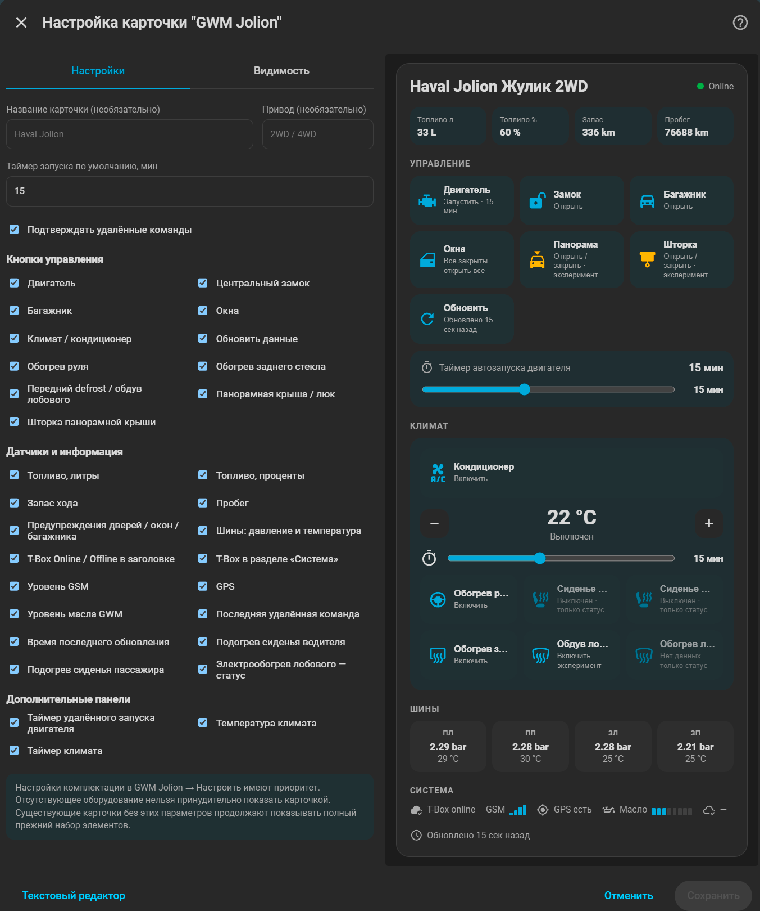

<p align="center">
  
</p>

<h1 align="center">GWM Jolion для Home Assistant</h1>

<p align="center">
  Неофициальная интеграция Home Assistant для Haval Jolion с российской телематикой GWM Cloud: статусы автомобиля, удалённое управление, климат, диагностика и собственная Lovelace-карточка.
</p>

> [!WARNING]
> Проект не связан с Great Wall Motor, HAVAL или официальным приложением GWM. Используется неофициальный облачный API. Текущая версия — **0.1.0-alpha.3**, предназначена для тестирования.

## Цель проекта

Сделать готовую HACS-интеграцию для владельцев **Haval Jolion**, которую можно установить в Home Assistant без ручной сборки десятков сенсоров и скриптов.

Основные цели:

- максимальное количество доступной телеметрии GWM;
- безопасное удалённое управление автомобилем;
- полноценные Home Assistant entities (`lock`, `climate`, `number`, `sensor`, `binary_sensor`, `device_tracker`, `button`);
- автоматическое определение возможностей конкретной комплектации;
- собственная красивая карточка уровня StarLine;
- минимум ручной настройки после установки.

## ✅ Подтверждённые функции

Следующие данные и состояния уже подтверждены на реальном **Haval Jolion 2022 Premium** и лежат в основе текущей интеграции.

### Подключение и телеметрия

- авторизация в российском GWM Cloud;
- подпись запросов GWM;
- получение автомобиля из аккаунта;
- получение `getLastStatus` и `findStatus`;
- T-Box online/offline;
- GPS-координаты автомобиля;
- пробег;
- количество топлива;
- запас хода;
- давление всех четырёх шин;
- температура всех четырёх шин.

### Состояния кузова

Физически проверена расшифровка:

- двигатель — выключен / работает;
- центральный замок — закрыт / открыт;
- четыре двери;
- багажник;
- четыре стекла;
- общий статус «двери открыты»;
- общий статус «окна открыты».

### Удалённый запуск двигателя

Подтверждено реальным автомобилем:

- запуск двигателя — T5 `0x03`;
- остановка двигателя — T5 `0x03`.

## 🟢 Основной функционал текущей Alpha

Следующие функции уже реализованы в коде проекта. Часть команд была перенесена из рабочей тестовой интеграции GWM RU и проходит повторное тестирование уже в `gwm_jolion`.

### Управление автомобилем

- запуск двигателя;
- остановка двигателя;
- закрытие автомобиля;
- открытие автомобиля;
- Home Assistant entity `lock` для центрального замка;
- открытие багажника;
- закрытие багажника;
- закрытие всех окон;
- моргание фарами;
- звуковой сигнал;
- фары + звуковой сигнал;
- принудительное обновление данных.

### Комфорт

В коде присутствуют команды:

- обогрев заднего стекла ON/OFF;
- обогрев руля ON/OFF.

До стабильного релиза они будут дополнительно проверяться на Jolion разных комплектаций.

### Диагностика

Создаются диагностические raw-сущности для исследования протокола:

- TPMS pressure status `2102001–2102004`;
- TPMS temperature status `2102007–2102010`;
- обучение стеклоподъёмников `2210010–2210013`;
- подогрев водительского сиденья `2220001`;
- подогрев пассажирского сиденья `2220002`;
- световые состояния `2204007–2204010`;
- GPS authorization `2310001`;
- уровень сигнала T-Box `4105008`;
- результат последней удалённой команды.

## 🧪 Экспериментальные функции

Экспериментальные возможности намеренно не считаются стабильными, пока не пройдут физические тесты на автомобиле.

### Климат `0x04`

Уже реализовано:

- entity `climate`;
- выбор температуры;
- отдельный entity времени работы климата **5–30 минут**;
- включение климата;
- выключение климата;
- попытка сохранить температуру и таймер в GWM Cloud через `modifyVehicleRemoteCtlInfo`.

Для российского cloud сейчас используется:

```text
0x04 / switchOrder=1 → ON
0x04 / switchOrder=0 → OFF
```

Полный цикл ON → изменение температуры → таймер → OFF ещё проходит финальную проверку.

### `vehicleBasicsInfo`

Интеграция экспериментально читает расширенную конфигурацию автомобиля. Потенциально оттуда доступны:

- сохранённая температура климата;
- время работы климата;
- время автозапуска;
- настройки подогрева сидений;
- состояния front/rear defrost;
- очиститель воздуха;
- дополнительные comfort-параметры.

Ошибка этого endpoint не должна ломать основное обновление автомобиля.

### Передний Defrost `0x0B`

Реализована экспериментальная команда интенсивного обдува лобового стекла. До подтверждения на Jolion кнопка не считается стабильной.

### Проветривание салона `0x11`

Реализована экспериментальная 60-секундная команда Cabin Clean / проветривания салона.

### Карточка `gwm-jolion-card`

Первая версия собственной Lovelace-карточки уже находится внутри интеграции:

```yaml
type: custom:gwm-jolion-card
```

Она должна автоматически находить сущности автомобиля через Device/Entity Registry и отображать:

- двигатель;
- центральный замок;
- климат и температуру;
- таймер климата;
- топливо, запас хода и пробег;
- двери, окна и багажник;
- четыре колеса;
- T-Box / GSM / GPS;
- последнюю удалённую команду.

**Статус карточки: experimental.** Механизм автоматической регистрации frontend сейчас дорабатывается, поэтому в Alpha возможна ошибка `Custom element doesn't exist: gwm-jolion-card`.
<p align="center">
  
</p>
## 🚧 Что планируется

Полный план находится в [ROADMAP.md](ROADMAP.md).

Основные направления развития:

- стабильная автоматическая загрузка `gwm-jolion-card`;
- внешний вид карточки уровня StarLine;
- изображение автомобиля и динамическое отображение открытых дверей/окон;
- индивидуальные состояния каждой двери и каждого окна;
- открытие окон;
- расширенное управление люком и шторкой;
- уровни подогрева водительского и пассажирского сидений;
- вентиляция сидений для поддерживаемых комплектаций;
- реальный статус обогрева руля;
- передний defrost;
- задний defrost;
- электрический обогрев лобового стекла `0x2A`;
- очиститель воздуха;
- Cabin Clean;
- полноценная расшифровка TPMS status-кодов;
- расшифровка всех доступных световых кодов;
- температура салона;
- наружная температура;
- температура охлаждающей жидкости;
- поиск реального напряжения / состояния 12V аккумулятора;
- capability detection по комплектации автомобиля;
- несколько автомобилей в одном GWM-аккаунте;
- diagnostics dump без персональных данных;
- примеры автоматизаций Home Assistant;
- локализация RU/EN;
- автоматические тесты и GitHub Actions;
- стабильные GitHub Releases и установка через HACS.

## Установка

### Через HACS

1. Откройте **HACS**.
2. Перейдите в меню **⋮ → Custom repositories**.
3. Добавьте:

```text
https://github.com/IndeecDen/ha-gwm-jolion
```

4. Тип репозитория: **Integration**.
5. Установите **GWM Jolion**.
6. Полностью перезапустите Home Assistant.
7. Перейдите:

```text
Настройки → Устройства и службы → Добавить интеграцию → GWM Jolion
```

8. Введите телефон и пароль от российского приложения GWM.
9. Для удалённых команд откройте настройки интеграции, включите удалённое управление и сохраните PIN безопасности автомобиля.

> Пока проект находится в Alpha, ручная установка может быть удобнее для частых тестовых обновлений.

### Ручная установка

Скопируйте каталог:

```text
custom_components/gwm_jolion
```

в:

```text
/config/custom_components/gwm_jolion
```

Должно получиться:

```text
/config/custom_components/gwm_jolion/
├── __init__.py
├── api.py
├── binary_sensor.py
├── button.py
├── climate.py
├── commands.py
├── config_flow.py
├── const.py
├── coordinator.py
├── device_tracker.py
├── entity.py
├── helpers.py
├── lock.py
├── manifest.json
├── number.py
├── sensor.py
├── strings.json
├── frontend/
├── brand/
└── translations/
```

После копирования выполните **полный перезапуск Home Assistant**.

## Настройка

После добавления интеграции используются данные официального приложения GWM:

- телефон;
- пароль;
- PIN безопасности автомобиля — только если нужны удалённые команды.

Рекомендуемый интервал обычного cloud polling:

```text
300 секунд
```

Между удалёнными командами используется cooldown, чтобы не отправлять несколько T5-команд одновременно.

## Отладка

Для тестирования включите debug-log:

```yaml
logger:
  logs:
    custom_components.gwm_jolion: debug
```

После изменения конфигурации перезапустите Home Assistant.

При отчёте об эксперименте желательно указать:

1. модель / год / комплектацию;
2. что было включено или выключено в машине;
3. какое действие выполнено в Home Assistant;
4. соответствующий фрагмент debug-log;
5. изменилось ли физическое состояние автомобиля.

Не публикуйте VIN, пароль, PIN, access token, IMSI, ICCID и точные координаты автомобиля.

## Безопасность

Удалённые команды могут физически менять состояние автомобиля.

- тестируйте двигатель и климат только на безопасно припаркованной машине;
- автомобиль должен находиться в `P`;
- запуск двигателя выполняйте только там, где безопасна работа ДВС;
- учитывайте cooldown команд GWM;
- экспериментальные команды используйте только если понимаете, что именно проверяется.

## Поддерживаемые автомобили

Главный приоритет проекта — **Haval Jolion с российской телематикой GWM**.

Сначала протокол будет стабилизирован на Jolion. После этого архитектура может быть расширена на другие автомобили HAVAL / GWM, использующие совместимый российский cloud API.

## Лицензия и благодарности

Проект распространяется по лицензии **MIT**.

В исследовании протокола и разработке использованы идеи и MIT-лицензированные наработки открытых проектов сообщества, в том числе:

- `roblencheg/HAVAL_H3`;
- `moryoav/ha-gwm-ev`.

Подробности — в [THIRD_PARTY_NOTICES.md](THIRD_PARTY_NOTICES.md).
