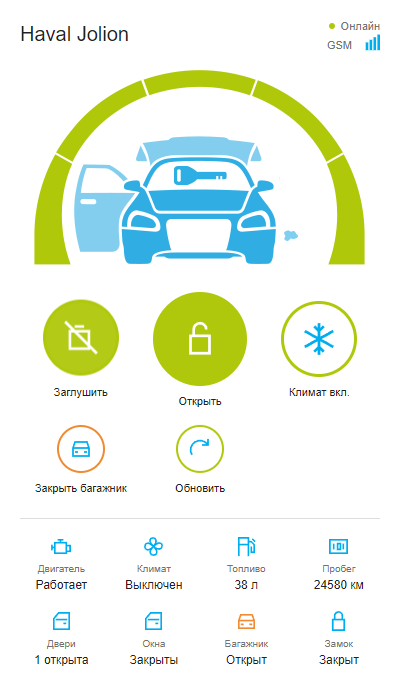
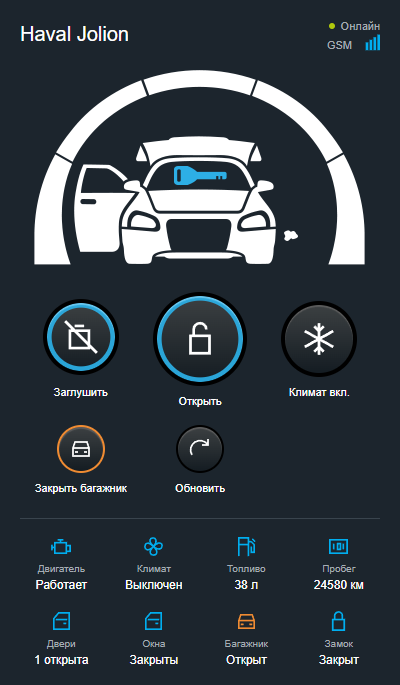

<p align="center">
  
</p>

<h1 align="center">GWM Jolion для Home Assistant</h1>

## Краткое описание

Неофициальная интеграция Home Assistant для **Haval Jolion** с российской телематикой **GWM Cloud**.

Интеграция получает состояние автомобиля, создаёт стандартные сущности Home Assistant и позволяет выполнять поддерживаемые удалённые команды. Основная разработка и тестирование выполняются на **Haval Jolion 2022 Premium**.

Текущая версия: **0.1.0-alpha.21**.

> Проект не связан с Great Wall Motor, HAVAL или официальным приложением GWM и использует неофициальный облачный API.

## Что нового в alpha.21

Карточка-пульт получила дизайн и анимации StarLine, светлую и тёмную темы и адаптивные статусы. Протокол и команды автомобиля сохранены. Подробности — в [CHANGELOG.md](CHANGELOG.md).

## Возможности

### Телеметрия

- двигатель: включён / выключен;
- климат: включён / выключен;
- центральный замок;
- 4 двери;
- 4 окна;
- багажник;
- топливо в литрах и процентах;
- запас хода;
- пробег;
- давление и температура всех 4 шин;
- уровень подогрева водительского и пассажирского сидений;
- T-Box online/offline;
- GPS-положение автомобиля;
- время последнего обновления данных.

### Управление

- запуск и остановка двигателя;
- открыть / закрыть автомобиль через стандартную `lock`-сущность Home Assistant;
- включить / выключить климат;
- установка температуры климата;
- настройка времени работы климата;
- открыть / закрыть багажник;
- моргнуть фарами;
- подать звуковой сигнал;
- моргнуть фарами и подать сигнал;
- включить / выключить обогрев заднего стекла;
- включить / выключить обогрев руля;
- ручное обновление данных.

### Карточки Home Assistant

Интеграция автоматически добавляет две Lovelace-карточки:

```yaml
type: custom:gwm-jolion-card
```

и анимированную карточку автомобиля:

```yaml
type: custom:gwm-jolion-remote-card
```

Карточки отображают основные состояния автомобиля и поддерживаемые команды управления.

### Анимированная карточка-пульт

```yaml
type: custom:gwm-jolion-remote-card
```

Удалённая карточка использует оформление и анимации [StarLine Card](https://github.com/Anonym-tsk/lovelace-starline-card): иллюстрацию автомобиля, подсветку закрытого замка, анимацию выхлопа при работающем двигателе и круглые кнопки. Команды и статусы адаптированы к GWM Jolion, включая климат, двери, окна и багажник. Иллюстрация автомобиля — универсальная из StarLine.

Тема автоматически следует Home Assistant. В редакторе можно включить тёмное оформление; в YAML доступны `dark: true` и `dark: false`. Настройки `device_id`, `entity`, `controls`, `statuses`, `info` и подтверждение команд сохраняются. Старый параметр `car_color` больше не влияет на иллюстрацию.

Заимствованные материалы и адаптированная remote-карточка распространяются под GPL-3.0-only; см. [сведения об источнике](custom_components/gwm_jolion/frontend/THIRD_PARTY_NOTICES.md) и [текст лицензии](custom_components/gwm_jolion/frontend/LICENSE.starline).

После обновления файлов интеграции перезапустите Home Assistant и обновите страницу панели: версия ресурса карточки изменена для сброса кэша.

<p align="center">
  
  
</p>

Превью получены на тестовых данных; значки Home Assistant в них заменены приближёнными SVG.

Новая иллюстрация показывает автомобиль спереди. Двери отображаются общим индикатором, багажник — отдельным слоем, работающий двигатель — ключом и анимированным выхлопом, климат — вращающимся вентилятором. Подсветка вокруг автомобиля означает закрытый центральный замок. Отдельная анимация каждого стекла и прежняя схема вида сверху больше не используются.

Обновление телеметрии сохраняет элементы карточки, поэтому анимации не перезапускаются и фокус кнопки не теряется. При включённом системном уменьшении движения анимации отключаются. На узком экране статусы перестраиваются в две колонки.

По умолчанию статусные плитки:

- Двигатель;
- Климат;
- Топливо;
- Пробег;
- Двери;
- Окна;
- Багажник;
- Замок.

Состояние окон сохраняется в текстовом статусе, индивидуальные сущности четырёх окон остаются доступны в Home Assistant. Замок читается из стандартной `lock`-сущности, GSM — из атрибута T-Box; отдельные raw-сенсоры для новой иллюстрации не требуются.

Безопасный набор controls в visual editor:

- замок;
- двигатель;
- климат;
- багажник;
- обновление;
- обогрев руля;
- обогрев заднего стекла.

Пример:

```yaml
type: custom:gwm-jolion-remote-card
title: Haval Jolion
dark: true
confirm_controls: true
controls:
  - engine
  - lock
  - climate
  - trunk
  - refresh
statuses:
  - engine
  - climate
  - fuel
  - mileage
  - doors
  - windows
  - trunk
  - lock
```

Уберите `dark`, чтобы автоматически следовать теме Home Assistant. Порядок `controls` определяет порядок кнопок; в примере замок находится в центре первого ряда. Обогревы `steering` и `rear_defrost` можно добавить через редактор или YAML.

## Установка и настройка

### Установка через HACS

1. Откройте **HACS**.
2. Перейдите в **Custom repositories**.
3. Добавьте репозиторий:

```text
https://github.com/IndeecDen/ha-gwm-jolion
```

4. Выберите тип **Integration**.
5. Установите **GWM Jolion**.
6. Полностью перезапустите Home Assistant.

### Добавление интеграции

После перезапуска откройте:

**Настройки → Устройства и службы → Добавить интеграцию → GWM Jolion**

Для подключения используются:

- номер телефона российского аккаунта GWM;
- пароль от приложения GWM;
- PIN безопасности — если требуется удалённое управление автомобилем.

### Параметры

В **GWM Jolion → Настроить** доступны основные параметры:

- интервал обновления данных;
- включение удалённого управления;
- PIN безопасности;
- задержка между удалёнными командами;
- наличие обогрева руля;
- наличие обогрева заднего стекла;
- отображение статуса подогрева водительского сиденья;
- отображение статуса подогрева пассажирского сиденья;
- Protocol Capture для диагностических и полевых тестов.

После изменения настроек при необходимости перезагрузите интеграцию или Home Assistant.

## Лицензии и благодарности

Основная интеграция — [MIT](LICENSE). Адаптированная карточка-пульт и материалы StarLine — [GPL-3.0-only](custom_components/gwm_jolion/frontend/LICENSE.starline). Источники и благодарности всем авторам приведены в [THIRD_PARTY_NOTICES.md](THIRD_PARTY_NOTICES.md).
