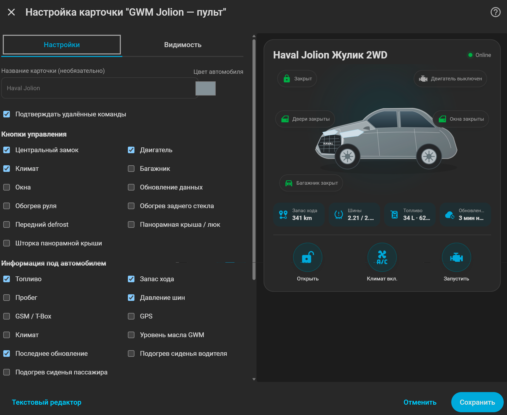

<p align="center">
  
</p>

<h1 align="center">GWM Jolion для Home Assistant</h1>

<p align="center">
  Неофициальная интеграция Home Assistant для автомобилей Haval Jolion с российской телематикой GWM Cloud.
</p>

> [!WARNING]
> Проект не связан с Great Wall Motor, HAVAL или официальным приложением GWM. Используется неофициальный облачный API. Текущая версия — **0.1.0-alpha.19.2**.

## Возможности

Интеграция получает данные автомобиля из российского GWM Cloud и создаёт стандартные сущности Home Assistant.

### Телеметрия

- состояние двигателя;
- центральный замок;
- двери, окна и багажник;
- пробег;
- остаток топлива в литрах и процентах;
- запас хода;
- давление и температура всех четырёх шин;
- GPS;
- статус T-Box;
- состояние климата;
- уровень масла GWM;
- время последнего успешного обновления.

### Удалённое управление

Поддерживаются:

- запуск и остановка двигателя;
- выбор времени удалённого запуска;
- закрытие и открытие автомобиля;
- открытие и закрытие багажника;
- закрытие всех окон;
- открытие всех окон;
- моргание фарами;
- звуковой сигнал;
- фары + звуковой сигнал;
- управление климатом;
- выбор температуры и времени работы климата;
- управление панорамой и шторкой;
- обогрев руля;
- обогрев заднего стекла;
- передний defrost;
- Cabin Clean / проветривание салона;
- принудительное обновление данных.

Часть comfort-функций может зависеть от комплектации автомобиля и остаётся экспериментальной.

### Надёжность удалённых команд

- одновременно выполняется только одна удалённая команда GWM;
- пока команда выполняется, остальные управляющие кнопки карточки временно блокируются;
- перед удалённым запуском двигателя интеграция обновляет состояние автомобиля и не отправляет команду, если видит, что двигатель уже работает, автомобиль не закрыт, открыта дверь или багажник;
- результат последней команды отображается как **выполняется / выполнено / ошибка**;
- явная ошибка GWM завершает ожидание сразу и освобождает очередь команд, а не удерживает управление до общего timeout;
- при временно недоступной телеметрии карточки показывают **Нет данных** и не угадывают состояние замка, двигателя, климата, окон или багажника;
- при проблеме с авторизацией Home Assistant может запросить повторный вход в аккаунт GWM без удаления интеграции.

## Встроенные карточки

Интеграция автоматически регистрирует **две** Lovelace-карточки. Дополнительные frontend-компоненты не требуются.

### Основная карточка

```yaml
type: custom:gwm-jolion-card
```

<p align="center">
  
</p>

Основная карточка автоматически находит сущности автомобиля и отображает основные состояния и органы управления: двигатель, замок, двери, окна, багажник, климат, топливо, запас хода, пробег, шины, T-Box, GPS и другие доступные функции.

Начиная с `0.1.0-alpha.16` у основной карточки есть собственный **визуальный редактор Home Assistant**. В нём можно без YAML выбрать, какие кнопки и данные показывать. Доступен выбор двигателя, замка, багажника, окон, климата, обновления, comfort-функций, топлива, запаса хода, пробега, шин, T-Box, GSM, GPS, масла, последней команды, времени обновления и статусов подогревов. Отдельно можно включать или скрывать таймер двигателя, температуру и таймер климата.

В `0.1.0-alpha.17` исправлена регистрация редактора: editor-модуль больше не зависит от порядка загрузки frontend-ресурсов Home Assistant и ожидает регистрацию основной карточки перед подключением визуального редактора.

Существующие карточки после обновления сохраняют прежний полный набор элементов, пока пользователь сам не изменит настройки в редакторе. Опциональное оборудование, отключённое в настройках интеграции, карточка не показывает даже если оно выбрано в её редакторе.

Для известных версий Jolion карточка также определяет тип привода `2WD / 4WD`. При необходимости его можно указать вручную:

```yaml
type: custom:gwm-jolion-card
drivetrain: 4WD
```

### Карточка-пульт
<p align="center">
  
</p>
Начиная с `0.1.0-alpha.13` доступна вторая карточка с компоновкой автомобильного охранного пульта: крупное изображение автомобиля в центре, статусы вокруг него, информационные плитки и круглые кнопки управления снизу.

```yaml
type: custom:gwm-jolion-remote-card
```

У карточки есть собственный **визуальный редактор Home Assistant**. В настройках карточки можно отдельно выбрать:

- кнопки управления;
- информационные показатели;
- статусы вокруг автомобиля;
- название карточки;
- цвет автомобиля;
- подтверждение удалённых команд.

По умолчанию выводятся три основные кнопки: замок, двигатель и климат. Можно добавить багажник, окна, обновление, обогрев руля, заднего стекла, передний defrost, панораму и шторку. Для информации доступны топливо, запас хода, пробег, шины, GSM/T-Box, GPS, климат, уровень масла GWM, время обновления и статусы подогрева передних сидений.

Настройки оборудования интеграции имеют приоритет: если функция отключена в **GWM Jolion → Настроить**, карточка-пульт её не покажет и не даст вызвать связанную удалённую команду.

Изображение автомобиля в карточке-пульте — отдельная оригинальная SVG-иллюстрация с пропорциями компактного SUV, крупной решёткой, фарами и шильдиком HAVAL, чтобы визуально читался именно Jolion. Цвет кузова можно менять из редактора карточки.

Пример ручной YAML-настройки:

```yaml
type: custom:gwm-jolion-remote-card
controls:
  - lock
  - engine
  - climate
  - trunk
  - windows
  - refresh
info:
  - fuel
  - range
  - mileage
  - tires
statuses:
  - lock
  - engine
  - doors
  - windows
  - trunk
  - climate
car_color: "#7c8489"
```

Компоновка второй карточки вдохновлена идеей `lovelace-starline-card`, однако код и автомобильная графика реализованы отдельно; исходный код и графические assets StarLine-карточки в проект не копировались.

### Автомобиль на карте Home Assistant

Интеграция создаёт GPS-сущность **Местоположение** (`device_tracker`). Начиная с `0.1.0-alpha.19.2` координаты приводятся к числовому формату, а для трекера используется автомобильная иконка. Сущность можно добавить в стандартную карточку Home Assistant **Карта** без дополнительных компонентов.

Пример YAML:

```yaml
type: map
entities:
  - entity: device_tracker.<ваша_сущность_местоположения>
hours_to_show: 24
```

Точное имя `entity_id` можно посмотреть в **Настройки → Устройства и службы → GWM Jolion → автомобиль → Местоположение**. Координаты используются только самой GPS-сущностью Home Assistant и по-прежнему не записываются в Protocol Capture или скачиваемую диагностику.

## Установка через HACS

1. Откройте **HACS**.
2. Перейдите в **⋮ → Custom repositories**.
3. Добавьте репозиторий:

```text
https://github.com/IndeecDen/ha-gwm-jolion
```

4. Выберите тип **Integration**.
5. Установите **GWM Jolion**.
6. Полностью перезапустите Home Assistant.
7. Откройте **Настройки → Устройства и службы → Добавить интеграцию**.
8. Найдите **GWM Jolion** и выполните настройку.

## Ручная установка

Скопируйте каталог:

```text
custom_components/gwm_jolion
```

в:

```text
/config/custom_components/gwm_jolion
```

После установки или обновления выполните полный перезапуск Home Assistant.

## Настройка

Для подключения используются данные аккаунта российского приложения GWM:

- номер телефона;
- пароль.

PIN безопасности автомобиля нужен только для удалённых команд, которые его требуют.

По умолчанию интеграция использует облачный polling с интервалом **300 секунд**. Параметры обновления и удалённого управления можно изменить в настройках интеграции.

В **Настройки → Устройства и службы → GWM Jolion → Настроить** также можно указать установленное опциональное оборудование: панорамную крышу и шторку, обогрев руля, обогревы стёкол, подогревы передних сидений, Cabin Clean и очиститель воздуха. Отключённые функции не загружаются как активные сущности, скрываются из встроенных карточек, а связанные удалённые команды блокируются интеграцией.

Там же начиная с `0.1.0-alpha.18` можно включить **Режим поиска GWM-кодов (JSONL-журнал)** для физических тестов и расшифровки неизвестной телеметрии. Этот режим предназначен для временного использования во время диагностической сессии.

## Поддерживаемые автомобили

Основная разработка и тестирование выполняются на **Haval Jolion 2022 Premium** с российской телематикой GWM.

Другие комплектации Haval Jolion с совместимой российской телематикой GWM также могут работать, однако набор доступных функций зависит от автомобиля.

Другие модели HAVAL / GWM официально пока не заявлены как поддерживаемые.

## Безопасность

Удалённые команды физически меняют состояние автомобиля. Используйте запуск двигателя, климат, замки, окна и другие команды только тогда, когда автомобиль находится в безопасных условиях.

Интеграция не заменяет штатные системы безопасности автомобиля.

## Диагностика

Для включения подробного обычного debug-журнала добавьте в `configuration.yaml`:

```yaml
logger:
  logs:
    custom_components.gwm_jolion: debug
```

После изменения конфигурации перезапустите Home Assistant.

Начиная с `0.1.0-alpha.15` диагностический экспорт содержит `signal_change_history` — ограниченную по размеру историю первого наблюдения и последующих изменений важных raw-сигналов. Она помогает сопоставлять физические действия с кодами GWM при тестировании дверей, окон, климата, подогрева сидений, руля и defrost.

### Protocol Capture — поиск GWM-кодов

Начиная с `0.1.0-alpha.18` интеграция умеет вести отдельную диагностическую сессию в формате JSONL. Она удобнее обычного debug-лога для физических тестов автомобиля, потому что после каждого успешного обновления сохраняет полный безопасный snapshot raw-сигналов и вычисляет изменения `previous → value`.

Чтобы начать сессию:

1. Откройте **Настройки → Устройства и службы → GWM Jolion → Настроить**.
2. Включите **Режим поиска GWM-кодов (JSONL-журнал)**.
3. Сохраните настройки.
4. После перезагрузки интеграции убедитесь, что диагностический сенсор **Запись протокола GWM** имеет состояние `recording`.
5. Установите автомобиль в исходное состояние и нажмите **Обновить данные** — первый успешный telemetry snapshot станет baseline.

Файл текущей сессии создаётся в:

```text
/config/gwm_jolion_protocol_capture/gwm_code_search_*.jsonl
```

Каждый успешный опрос записывает:

- полный snapshot всех увиденных raw-кодов;
- diff `previous → value`;
- неизвестные GWM-коды;
- безопасный whitelist `vehicleBasicsInfo`;
- источник обновления: `poll`, `manual_button`, `remote_command` или `remote_start_guard`.

Начиная с `0.1.0-alpha.19.2` Protocol Capture дополнительно сохраняет диагностический контекст, который раньше мог теряться:

- `signal_units` — единицу измерения для каждого `items[].code`, если GWM её прислал;
- `signal_item_seen_keys` — полный набор имён полей, встреченных внутри элементов `items[]`;
- `status_meta` и `status_meta_changes` — безопасные верхнеуровневые поля `getLastStatus`, включая `oilQty`, `percentageOfOil`, `charge`, `serviceStatus`, `acquisitionTime`, `uploadTime`, `updateTime`, `deviceType` и `command`, если они присутствуют как простые значения;
- `status_structure` — имена и типы полей полного ответа `getLastStatus` без их значений, поэтому новые/неизвестные поля не пропадут незаметно;
- `vehicle_basics_seen_keys` и `vehicle_basics_structure` — инвентаризацию полей `vehicleBasicsInfo`, включая неизвестные ключи без автоматического сохранения их значений;
- `tbox_meta`, `tbox_meta_changes` и `tbox_structure` — безопасные известные значения `findStatus` и структуру остальных T-Box полей;
- schema Protocol Capture повышена до `2`.

Это позволяет во время одного полевого теста заметить потенциальные параметры наружной температуры, света, масла, заряда, T-Box и других функций даже тогда, когда мы ещё не знаем их точное назначение.

Автоматические capture-записи не включают VIN, точные координаты, телефон/аккаунт, пароль, PIN, access token, IMSI/ICCID, vehicle ID и другие device identifiers. Для неизвестных или потенциально чувствительных полей записывается только структура: имена ключей и типы, но не значения.

### Метки этапов теста

Начиная с `0.1.0-alpha.19` можно добавлять короткие пользовательские метки через действие **GWM Jolion: Добавить метку в журнал GWM** (`gwm_jolion.add_capture_marker`). Например:

```yaml
action: gwm_jolion.add_capture_marker
data:
  label: DRIVER_SEAT_L3
```

Метка записывается отдельной строкой `type=marker`, не изменяет предыдущие telemetry-значения и не ломает baseline. Максимальная длина метки — 80 символов. Не используйте метки для персональных или секретных данных.

Удобная последовательность физического теста:

1. добавить метку этапа, например `DRIVER_SEAT_L3`;
2. физически изменить только одну функцию автомобиля;
3. убедиться, что функция действительно включилась/выключилась;
4. нажать **Обновить данные**;
5. перейти к следующему этапу.

### Итоговая диагностика одной сессии

Начиная с `0.1.0-alpha.19` стандартная функция Home Assistant **Скачать диагностику** включает текущую Protocol Capture-сессию прямо в итоговый JSON в разделе `protocol_capture → session_export`.

Поэтому после полевого теста необязательно вручную искать `.jsonl`-файл:

1. пока Protocol Capture ещё включён, выполните последнее **Обновить данные**;
2. откройте интеграцию GWM Jolion и выберите **Скачать диагностику**;
3. сохраните полученный JSON;
4. только после этого выключите режим поиска кодов.

Начиная с `0.1.0-alpha.19.1` сам JSONL-журнал по-прежнему не ограничивается этим лимитом. Ограничение относится только к копии сессии внутри стандартной диагностики Home Assistant: экспорт всегда сохраняет **первый telemetry baseline + до 5000 самых свежих корректных записей**. Таким образом baseline не может быть вытеснен длинной сессией, а максимальный размер `session_export.records` составляет 5001 запись. Короткая сессия экспортируется целиком.

Служебные поля `records_in_file`, `valid_records_in_file`, `records_exported`, `truncated`, `baseline_preserved`, `recent_records_limit`, `selection`, `invalid_lines` и `read_error` позволяют проверить, вошла ли сессия целиком и был ли сохранён baseline. Полный JSONL-файл всегда остаётся в `/config/gwm_jolion_protocol_capture/`.

Диагностический сенсор **Запись протокола GWM** показывает состояние `disabled`, `recording` или `error`. В его атрибутах доступны имя активного файла, число записанных строк, время и источник последней записи, число последних изменений, последняя метка и последняя ошибка записи.

Диагностический экспорт интеграции скрывает персональные и чувствительные данные автомобиля и аккаунта. Тем не менее перед публикацией диагностик рекомендуется проверить файл самостоятельно.

## Ошибки и предложения

Если функция работает неправильно или ваша комплектация ведёт себя иначе, создайте Issue в репозитории проекта:

https://github.com/IndeecDen/ha-gwm-jolion/issues

При описании проблемы желательно указать:

- модель, год и комплектацию автомобиля;
- версию Home Assistant;
- версию интеграции;
- что именно не работает;
- соответствующий фрагмент debug-лога без персональных данных.

## Лицензия

Проект распространяется по лицензии **MIT**.

Использованные open-source проекты и благодарности перечислены в [THIRD_PARTY_NOTICES.md](THIRD_PARTY_NOTICES.md).

Автор проекта: **IndeecDen**.
