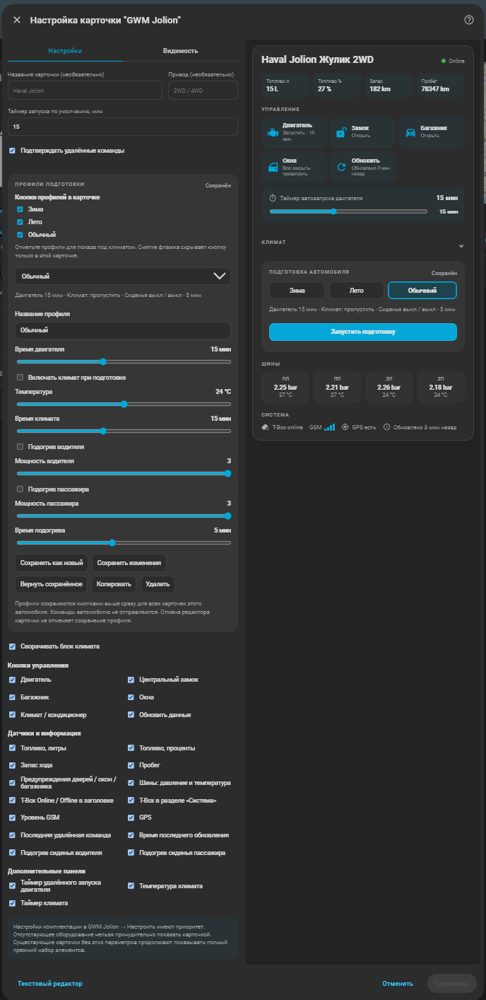
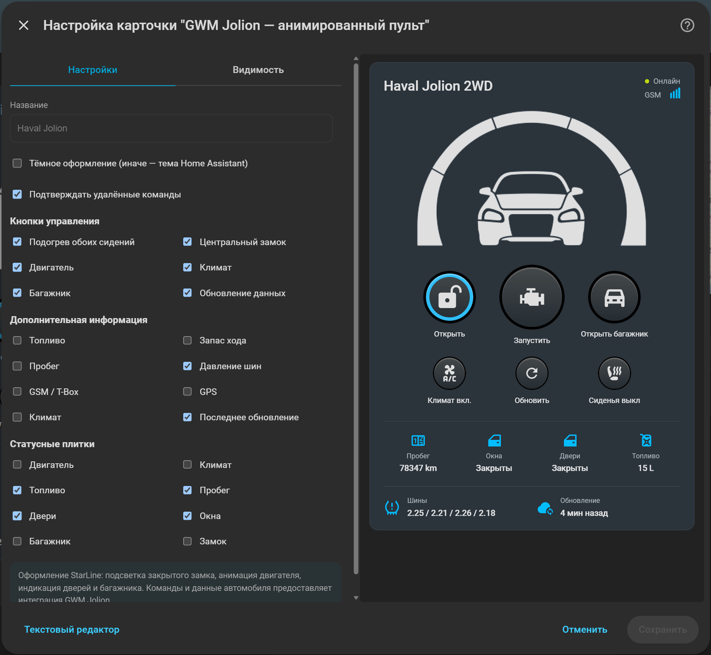

<p align="center"></p>

# GWM Jolion для Home Assistant

Неофициальная интеграция для **Haval Jolion с российским GWM Cloud**: состояние автомобиля, удалённое управление и две встроенные карточки. Разрабатывается на Haval Jolion 2022 Premium.

Версия **0.1.0-beta.2.1** · [Изменения](CHANGELOG.md) · [Планы](ROADMAP.md)

## Возможности

- Двигатель, замок, двери, окна, багажник и состояние климата.
- Топливо, запас хода, пробег, давление и температура четырёх шин.
- Местоположение на карте, связь с автомобилем и время обновления.
- Запуск и остановка двигателя, замок, багажник, световой и звуковой сигналы.
- Климат: включение, температура и время работы.
- Подогрев водительского и пассажирского сидений: уровни **0–3**, таймер **1–10 минут**.
- Закрытие окон и проветривание.

**Подогревы сидений и обновлённые команды окон требуют проверки на автомобиле.** Набор функций зависит от комплектации; облачные данные могут приходить с задержкой.

## Карточки

Основная карточка: состояние автомобиля, команды, климат, подогревы и шины.

<p align="center"></p>

```yaml
type: custom:gwm-jolion-card
```

В разделе климата выберите уровень каждого сиденья и таймер, затем нажмите **«Применить»**. Мощность 1–3 и таймер задаются ползунками. Переключатель рядом с названием выбирает, включить или выключить сиденье при применении. Показания автомобиля отображаются рядом с настройками.

Чтобы подготовить автомобиль одной кнопкой, включите **«Включить климат и сиденья при запуске»** в разделе климата. Выберите температуру, длительность климата, сиденья, мощность и таймер, затем нажмите запуск двигателя. В этом режиме изменение температуры и времени климата только готовит настройки. Снятый переключатель сиденья означает команду выключения этого сиденья.

Интеграция последовательно запускает двигатель, климат и подогревы, проверяя ответы GWM. Между командами сохраняется настроенная пауза; это не строго одновременное включение. При ошибке дальнейшие этапы прекращаются, уже выполненные команды не отменяются. Настройки сохраняются в Home Assistant отдельно для каждого автомобиля: температура и длительность климата, время автозапуска, выбранные сиденья, мощность и таймер подогрева, режим запуска с климатом. Они восстанавливаются после перезапуска и доступны на телефоне и компьютере. Восстановление только заполняет карточку и не отправляет команды автомобилю.

Анимированная карточка-пульт с автоматической светлой или тёмной темой. В разделе редактора «Кнопки управления» доступен «Подогрев обоих сидений»: включает оба сиденья на уровень 3 на 10 минут; повторное нажатие при активном подогреве выключает оба. Подпись «Сиденья вкл/выкл» и подсветка отражают показания автомобиля. При неизвестном статусе кнопка недоступна.

<p align="center"></p>

```yaml
type: custom:gwm-jolion-remote-card
```

Карточки подключаются автоматически. Если автомобилей несколько, выберите нужное устройство в редакторе карточки. Изображения показывают пример отображения карточек.

## Установка

1. В HACS → **Пользовательские репозитории** добавьте `https://github.com/IndeecDen/ha-gwm-jolion`, категория **Интеграция**.
2. Установите **GWM Jolion** и перезапустите Home Assistant.
3. Откройте **Настройки → Устройства и службы → Добавить интеграцию → GWM Jolion**.
4. Введите телефон и пароль аккаунта GWM. Для удалённого управления укажите PIN безопасности.
5. Добавьте карточку на панель с одним из примеров выше.

После обновления интеграции перезапустите Home Assistant и обновите страницу панели.

## Настройки

В **GWM Jolion → Настроить** доступны:

- интервал обновления;
- разрешение удалённого управления и PIN безопасности;
- пауза между командами;
- наличие подогрева каждого переднего сиденья.

Температура и время работы климата задаются в карточке или стандартных сущностях Home Assistant. Для автоматизаций подогревов доступно действие `gwm_jolion.set_seat_heating`: `driver` и `passenger` — уровни 0–3, `operation_time` — минуты. При нескольких автомобилях укажите `entry_id` нужной интеграции.

## Лицензии и благодарности

Интеграция — [MIT](LICENSE). Оформление карточки-пульта основано на [StarLine Card](https://github.com/Anonym-tsk/lovelace-starline-card), лицензия [GPL-3.0-only](custom_components/gwm_jolion/frontend/LICENSE.starline). Спасибо авторам исходных проектов; подробности — в [THIRD_PARTY_NOTICES.md](THIRD_PARTY_NOTICES.md).

Проект не связан с Great Wall Motor или HAVAL.
